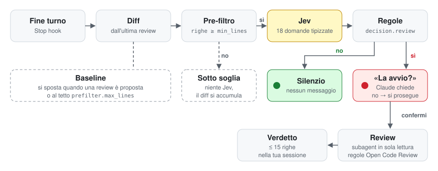

<p align="center">
  
</p>

# traffic-light-review 🚦

[](LICENSE)
[](https://code.claude.com)

**Plugin per Claude Code che, a ogni fine turno, decide se le tue modifiche meritano una code review.**

🟢 nessuna review necessaria → silenzio. 🔴 review consigliata → Claude ti chiede se avviarla.

```
Consiglio una review delle modifiche dall'ultima review (3 file, +120 −20): autenticazione/permessi (0.91),
rischio injection da verificare, test mancanti. La avvio?
```

- **Zero attrito**: niente commit, niente push, nessun file nella working tree. Basta una repo git, anche solo `git init`.
- **Triage economico**: il diff lo giudica [Jev di TypeSafe AI](https://typesafe.ai) con 18 domande tipizzate, non un LLM che scrive.
- **Contesto pulito**: la review gira in un subagent isolato con le regole di [Open Code Review](https://github.com/alibaba/open-code-review); nella tua sessione torna solo un verdetto di poche righe.

## Quickstart

**Requisiti:** Claude Code con supporto ai plugin, [uv](https://docs.astral.sh/uv/), `git` ≥ 2.31, una API key di [TypeSafe AI](https://typesafe.ai).

1. Esporta la chiave nella shell da cui avvii Claude Code (per esempio in `~/.zshrc`):

   ```bash
   export TYPESAFE_API_KEY=...
   ```

2. Dalla root del progetto, installa il plugin:

   ```bash
   claude plugin marketplace add alessandromaddaloni98/traffic-light-review --sparse .claude-plugin plugin --scope project
   claude plugin install traffic-light-review@traffic-light-review --scope project
   ```

3. Riavvia Claude Code e lavora come sempre. Al primo turno compare `traffic-light-review: attivo su N file`; dal turno dopo il triage è attivo.

> `--scope project` scrive il plugin in `.claude/settings.json`: committalo e chi apre il progetto se lo vede proporre. Usa `--scope local` per averlo solo tu, `--scope user` per tutti i tuoi progetti.

## Come funziona

<p align="center">
  
</p>

1. **Diff accumulato.** Lo Stop hook calcola il tree dei file di codice su un indice git separato e lo confronta con quello dell'ultima review proposta. I turni non ancora rivisti si sommano; l'indice e lo staging della repo non vengono toccati.
2. **Pre-filtro.** Sotto `prefilter.min_lines` righe, o se cambiano solo lockfile e file minificati, Jev non viene chiamato.
3. **Triage.** Jev risponde con probabilità a domande su segreti, injection, API insicure, autenticazione, test, contratti pubblici, migrazioni, errori, risorse, performance e impatto ([`checks.json`](plugin/traffic_light_review/checks.json)).
4. **Decisione.** Regole dichiarative in config (`decision.review`) trasformano le probabilità in sì/no. Le aggravanti e i check incerti non fanno partire la review da soli, ma finiscono tra i motivi.
5. **Review, solo con il tuo sì.** Il subagent `traffic-light-review:reviewer` (sola lettura) verifica prima i punti segnalati da Jev, poi applica la regola OCR di ogni file e riporta i problemi `critical`, `high` e `medium`.

La baseline avanza quando una review viene proposta (accettata o rifiutata) o quando il diff supera `prefilter.max_lines`: così le modifiche piccole non si perdono e il diff non cresce senza limite.

## Cosa vedi

A fine turno la prima riga dice l'esito; sotto, i file contati dall'ultima review. Totali e file sono gli stessi nel riepilogo e nella domanda; lockfile e minificati (`prefilter.ignore_paths`) stanno su una riga a parte e non contano.

**🔴 Review consigliata.** Il riepilogo dice *dove*: `←` segna i file con un indizio per la regola scattata. Il *perché* sta solo nella domanda di Claude: le regole con la probabilità di Jev, poi a parole i check incerti e le aggravanti.

```
🔴 traffic-light-review · review consigliata · 3 file, +120 −20
   src/api/users.py     M  +30 −10
   src/auth/login.py    M  +80 −10  ← autenticazione/permessi
   tests/test_login.py  A  +10 −0  ← autenticazione/permessi
   ignorati (1): package-lock.json
```
> Consiglio una review delle modifiche dall'ultima review (3 file, +120 −20): autenticazione/permessi (0.91), rischio injection da verificare, test mancanti. La avvio?

**🟢 Nessuna review necessaria.** Silenzio totale. Con `report.summary: always` compare comunque il riepilogo:

```
🟢 traffic-light-review · nessuna review necessaria · 3 file, +120 −20
   src/api/users.py     M  +30 −10
   src/auth/login.py    M  +80 −10
   tests/test_login.py  A  +10 −0
   ignorati (1): package-lock.json
```

**⚪ Sotto soglia.** Jev non viene chiamato; le righe si accumulano fino al turno che supera `prefilter.min_lines`.

```
⚪ traffic-light-review · sotto soglia (4 < 10), accumulo · 1 file, +4 −0
   src/api/users.py  M  +4 −0
```

**⚪ Jev non disponibile.** Errore di rete o dell'API: nessun verdetto, la baseline resta ferma e il turno dopo riprova.

```
⚪ traffic-light-review · triage saltato: TypeSafeAPIError (HTTP 503) · 3 file, +120 −20
   src/api/users.py     M  +30 −10
   src/auth/login.py    M  +80 −10
   tests/test_login.py  A  +10 −0
   ignorati (1): package-lock.json
```

Se il diff era troppo grande per Jev, in fondo ai file compare `⚠️ Jev ha visto solo parte del diff: 1 file omesso, 2 troncati`. Con `/traffic-light-review:config set report.checks all` si aggiunge un blocco `Dettaglio Jev:` con pre-filtro, banda di incertezza, tutte le 18 risposte e il costo, utile per tarare le soglie.

**Verdetto del subagent.** Se confermi, dopo la review torna al massimo 15 righe, per esempio:

```
Review: 🔴 2 problemi
- [high/security] src/auth/login.py:42 — la sessione non scade mai → impostare una scadenza e controllarla in validate_session
- [medium/test] tests/test_login.py:1 — nessun caso con password errata → aggiungere un test che si aspetta il rifiuto
Focus Jev: touches_auth confermato, injection_risk escluso, adds_tests confermato
Copertura: 3/3 file
```

## Configurazione

I default stanno in [`config.default.yaml`](plugin/traffic_light_review/config.default.yaml). Per cambiarli usa la skill dalla chat; la config personale finisce in `.git/traffic_light_review/config.yaml`, mai nella root del progetto.

```
/traffic-light-review:config                                  mostra la config effettiva
/traffic-light-review:config set prefilter.min_lines 30
/traffic-light-review:config set files.exclude_paths ["src/legacy/*"]
/traffic-light-review:config reset prefilter.min_lines
```

| Chiave | Default | Significato |
|---|---|---|
| `prefilter.min_lines` | `10` | Righe cambiate sotto cui Jev non viene chiamato. |
| `prefilter.max_lines` | `400` | Righe accumulate oltre cui la baseline riparte. |
| `decision.review` | 12 regole | Regole `{check, op: gte\|lte, value[, unless]}` che fanno proporre la review. |
| `decision.aggravating` | 3 regole | Stesso formato: si aggiungono ai motivi, non fanno partire la review. |
| `files.exclude_paths` | `[]` | Path da escludere (anche da ciò che va a Jev). |
| `report.summary` | `unless_no_review` | Quando mostrare il riepilogo: `always`, `unless_no_review`, `above_threshold`, `never`. |

Tutte le chiavi sono commentate nel file dei default. Le liste sostituiscono quelle di default, non si sommano; `set` non scrive nulla se la config risultante non è valida.

<details>
<summary>Regole di review personalizzate</summary>

Le 53 regole di Open Code Review v1.12.9 sono incluse nel plugin ([`ocr_rules/`](plugin/traffic_light_review/ocr_rules/)): non serve la CLI `ocr`. Per sovrascriverle usa lo stesso formato di OCR in `.opencodereview/rule.json` (progetto) o `~/.opencodereview/rule.json`:

```json
{"rules": [
  {"path": "src/legacy/**", "rule": "Codice legacy: segnala solo i crash."},
  {"path": "**/*.py", "rule": "docs/python_rules.md", "merge_system_rule": true}
]}
```

</details>

## Privacy

- A TypeSafe AI viene inviato il diff dall'ultima review, troncato e con i segreti riconoscibili sostituiti da `[REDACTED]`. È un filtro a pattern, non una garanzia: escludi con `files.exclude_paths` ciò che non deve uscire.
- La chiave si legge solo da `TYPESAFE_API_KEY`: mai scritta su disco né stampata. Il plugin non legge file `.env`.
- Il subagent ha solo Read, Grep e Glob: non modifica file e non esegue comandi.

## Problemi comuni

| Sintomo | Causa |
|---|---|
| `uv: command not found` | Claude Code non vede `uv` nel `PATH` (tipico se VS Code è aperto dal Dock). Avvialo con `code .` da una shell dove `uv` funziona. |
| `qui non c'è git` a ogni turno | Il progetto non è una repo git: `git init` o disabilita il plugin. |
| Nessun messaggio dopo modifiche grosse | Jev non ha consigliato la review. Le risposte sono in `.git/traffic_light_review/last_triage.json`; per vedere sempre il riepilogo: `/traffic-light-review:config set report.summary always`. |
| Nessun riepilogo e chiave mancante | L'hook esce con codice 4 e un messaggio su stderr: esporta `TYPESAFE_API_KEY` e riavvia la sessione. |

**Limiti noti:** nessun lock tra sessioni parallele sullo stesso progetto; le modifiche fatte fuori da Claude Code finiscono comunque nel diff.

## Sviluppo

```bash
claude --plugin-dir ./plugin                              # carica il plugin senza installarlo
claude plugin validate . && claude plugin validate ./plugin
```

Chi installa riceve solo [`plugin/`](plugin/); gli script di sviluppo (`dev/`) restano nella repo. Per aggiornare le regole OCR: `uv run --script dev/sync_ocr_rules.py`, poi `uv run --script dev/ocr_parity_fixture.py` (serve la CLI `ocr`).

## Licenza

[MIT](LICENSE), tranne [`plugin/traffic_light_review/ocr_rules/`](plugin/traffic_light_review/ocr_rules/): regole di [Open Code Review](https://github.com/alibaba/open-code-review) copiate senza modifiche, © 2026 alibaba/open-code-review Contributors, [Apache-2.0](plugin/traffic_light_review/ocr_rules/LICENSE). Progetto non affiliato ad Alibaba né a Open Code Review.
